<p align="center">
  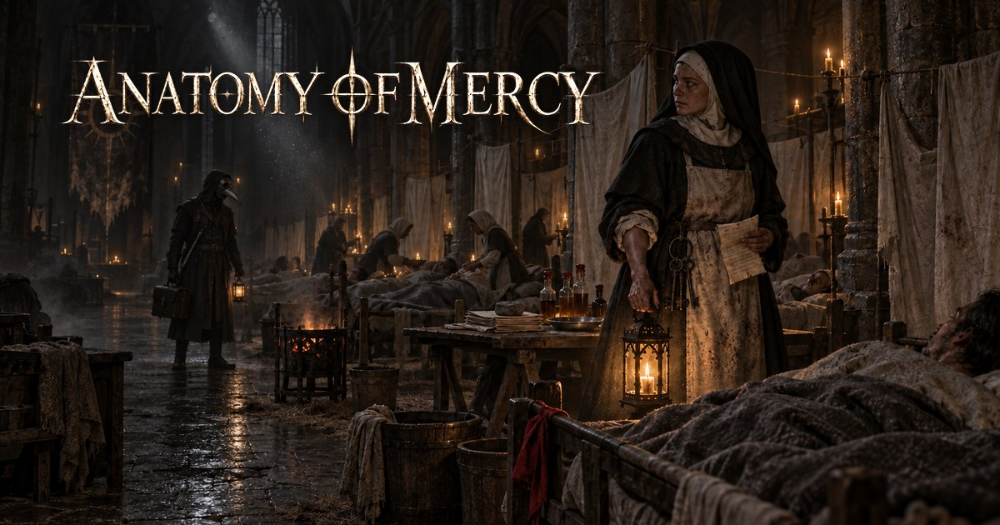
</p>

<h3 align="center">Every cure leaves a scar.</h3>

<p align="center">
  A dark fantasy game about plague medicine, faith<br>and the price of saving a life.
</p>

<p align="center">
  
  
  
  
</p>

---

## The premise

Vespera grew rich on trade, pilgrimage and medical scholarship. It is now dying of the Crimson Plague, a disease that turns blood to crystal and leaves dust behind that infects whoever breathes it. Quarantine gates divide the districts. The Church of Light feeds the sick, nurses them, buries them, and burns the streets it cannot save.

You are Julian, an outcast physician. He can cure what nobody else can cure. The material his treatment needs comes out of living people.

**Every cure has a donor.**

This is not a game about defeating a plague. It is a game about how far a decent person will go for someone he loves, and what is left of him afterwards. The horror is quiet and procedural: a single instrument laid out on a cloth, a name written on a list, a door that was sealed first.

<p align="center">
  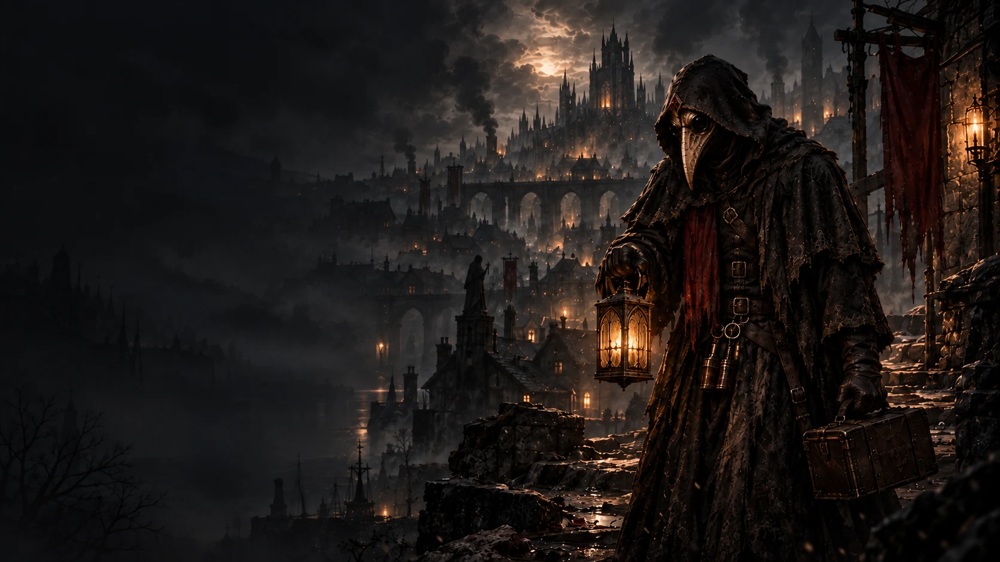
</p>

## What the game is about

<table>
  <tr>
    <td width="25%">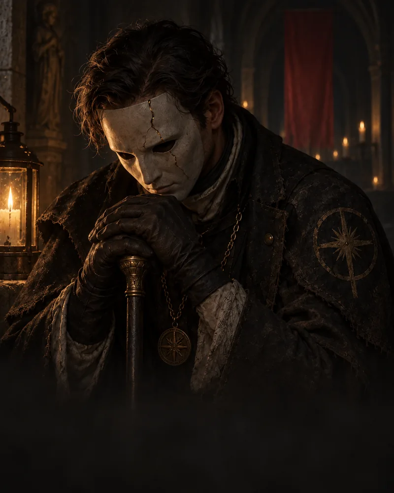</td>
    <td width="25%">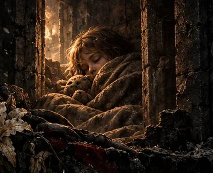</td>
    <td width="25%">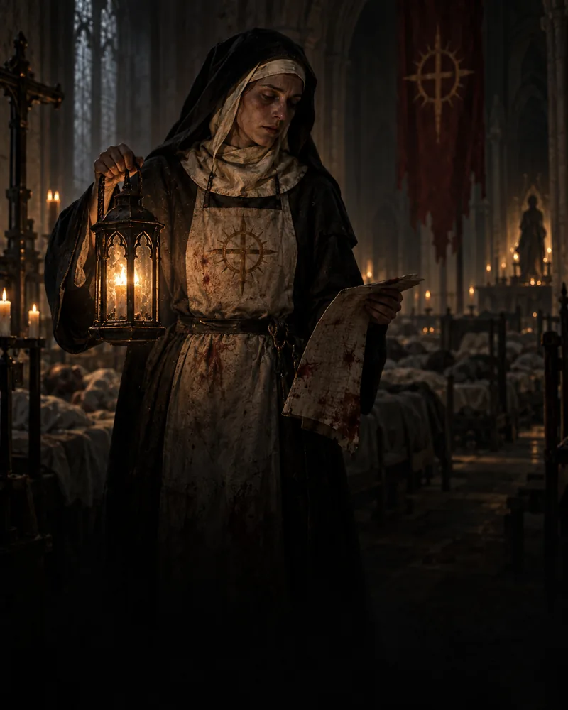</td>
    <td width="25%">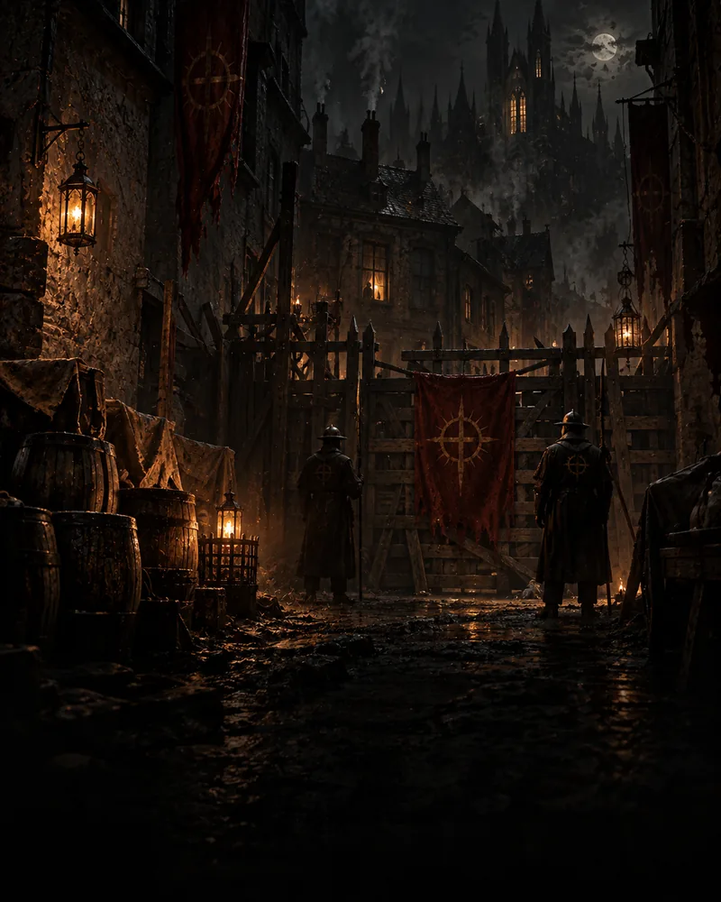</td>
  </tr>
  <tr>
    <td><b>Difficult choices</b><br>Save a life. Carry the cost.</td>
    <td><b>People, not cases</b><br>Every patient has something left to lose.</td>
    <td><b>Faith and medicine</b><br>The same faith can shelter and condemn.</td>
    <td><b>A city in quarantine</b><br>Order has a price. So does defiance.</td>
  </tr>
</table>

Every patient is a person, every remedy consumes something, and every decision changes who Julian becomes. There are no clean victories, only consequences you are willing to carry.

## The world

<p align="center">
  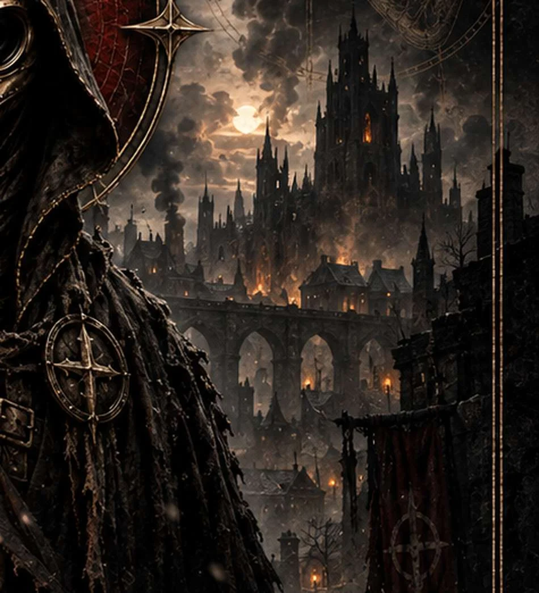
</p>

The Crimson Plague moves through flesh, memory and belief. Quarantine divides the streets. Doctors count what remains. Somewhere between duty and desperation, mercy acquires an anatomy of its own.

The world is built to stay morally ambiguous, and every part of it is written to hold that ambiguity:

- **The Church of Light** holds executive power during the epidemic. Its **Order of the Lantern** runs the wards, kitchens and almshouses. Its **Holy Office** investigates and judges. Its **Inquisition** seals districts and carries out purges. The Church genuinely protects people, and it genuinely burns them. It is never drawn as obviously evil.
- **Julian** is genuinely trying to save people. That is what makes him frightening.
- **Consequence stays visible on the body.** A scar, a missing piece, a stiffened walk. The state of a donor after a procedure matters more than the procedure.

## The stories

Before the game begins, there is a cycle of four short stories. They introduce the people, choices and silences that shaped Julian, and they are canon.

<table>
  <tr>
    <td width="25%" align="center">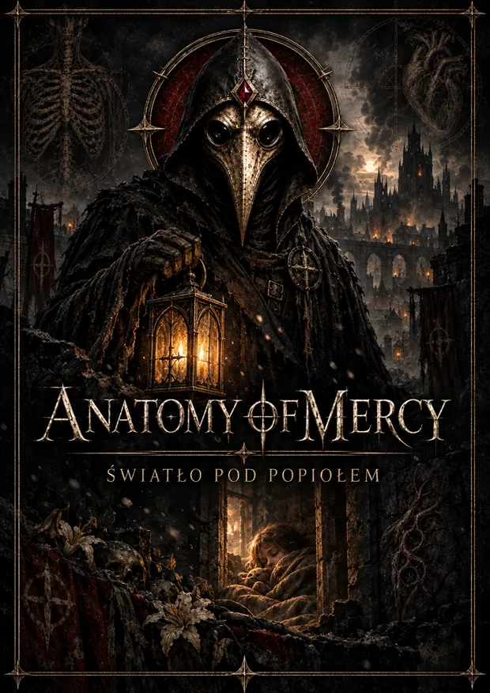</td>
    <td width="25%" align="center">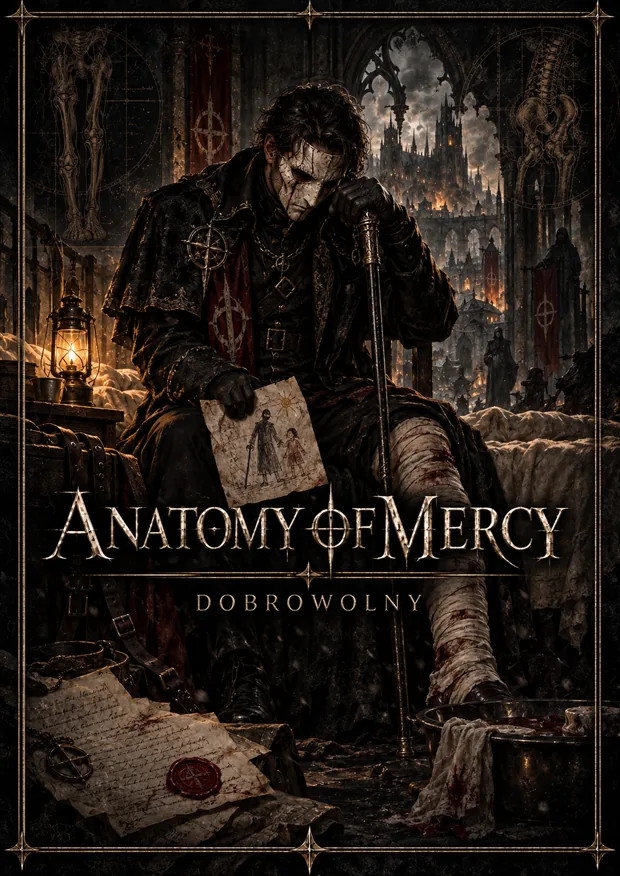</td>
    <td width="25%" align="center">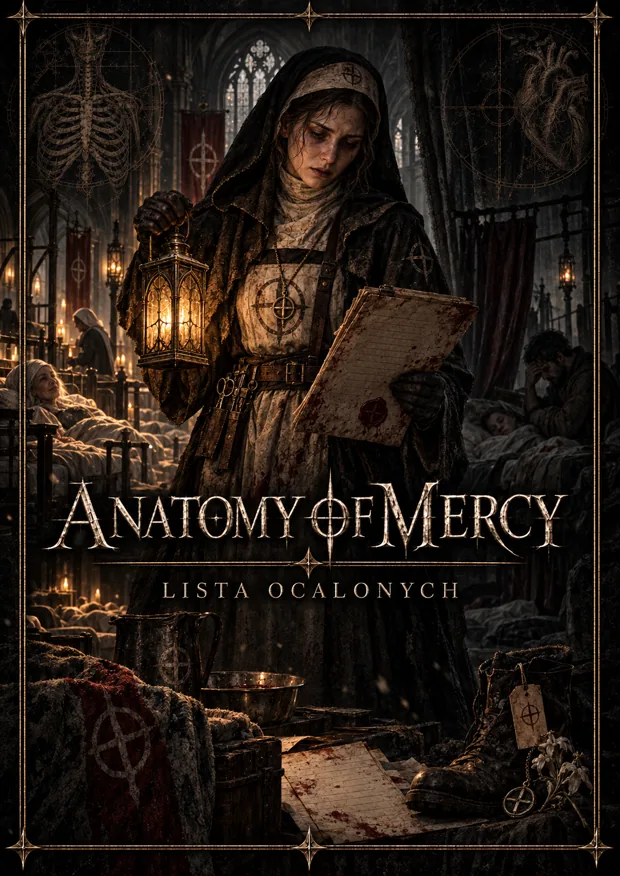</td>
    <td width="25%" align="center">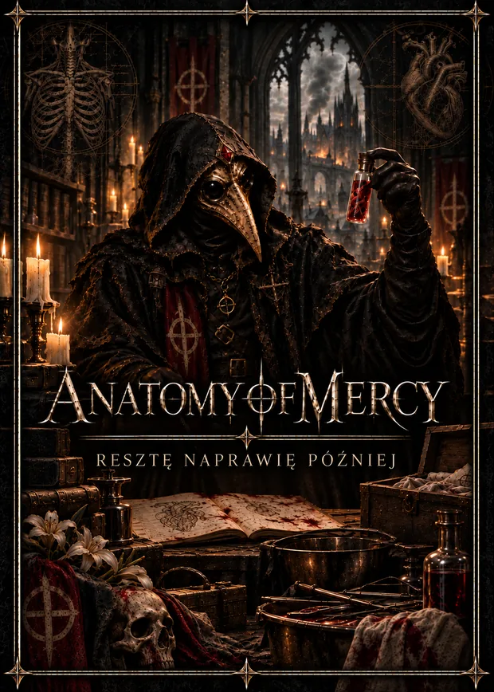</td>
  </tr>
  <tr>
    <td valign="top"><b>I. Light Beneath the Ash</b><br><i>Światło pod popiołem</i><br><br>A father remembers the night a cure demanded something he has spent twenty years refusing to name.</td>
    <td valign="top"><b>II. The Volunteer</b><br><i>Dobrowolny</i><br><br>A commander refuses to give up the tissue a dying child needs, and watches one word enter the record against him.</td>
    <td valign="top"><b>III. The List of the Saved</b><br><i>Lista ocalonych</i><br><br>A sister running the ward records who leaves on the two carts, and who is written down as left behind.</td>
    <td valign="top"><b>IV. I Will Fix the Rest Later</b><br><i>Resztę naprawię później</i><br><br>A doctor leaves behind notes that explain his methods more clearly than they explain his mercy.</td>
  </tr>
</table>

Four witnesses, one wound seen from different sides.

All four stories are finished and written in Polish. English versions do not exist yet, and none of the texts are published for reading. The covers above are the only part of the cycle that is public so far.

## Project status

Anatomy of Mercy is in active development and has **no release date**. Nothing is announced, nothing is for sale, and there is no mailing list yet.

What exists today:

| Part of the project | Where it stands |
|---|---|
| Design documentation | Complete enough to build from, maintained as a living document |
| Story cycle | Four stories finished in Polish, unpublished |
| Visual identity | Established, with a written world and visual brief driving every new image |
| Website | Built and bilingual, not published yet |
| Game build | Not started. The first milestone is a combat proof, and it is gated behind the work above |

Everything here is made by DominDev, an independent studio.

## Contact

For publishing, press and project enquiries, write to **contact@anatomyofmercy.com**.

The website that this repository builds will live at `anatomyofmercy.com`. It is not published yet.

<details>
<summary><b>About this repository</b></summary>

<br>

This repository holds the source of the official Anatomy of Mercy website. It is not the game.

**Built with**

- Eleventy for static HTML generation
- Sass and BEM for styles
- Vanilla JavaScript for progressive enhancement
- Cloudflare Workers with Static Assets as the target hosting platform

**Local development**

Use Node.js 24 when possible.

```text
npm install
npm run dev
```

The development server serves English at `/` and Polish at `/pl/`.

**Production build**

```text
npm run build
npm run check
```

`npm run check` runs the build validation in `scripts/validate-build.mjs`, which enforces the things that have broken before: required files, language and canonical metadata, heading order, link preview metadata, key parity between the English and Polish data files, image existence, and a guard against any property on the site header that would turn it into a containing block for the mobile menu overlay.

Production output is written to `dist/`. That directory is generated and must never be edited or committed.

**Contributing and content rules**

This is not an open source project and pull requests are not expected. If you found a genuine problem with the site, the email above is the right way to reach us.

Do not add API keys, passwords, personal data, unapproved artwork or draft publications to this repository. Story files and images must be approved before they are copied into the website source. Every image shipped here is recorded in [ASSETS.md](ASSETS.md) together with its source file and its role.

</details>

## Copyright

Copyright 2026 DominDev. All rights reserved.

The source code, the Anatomy of Mercy name, the written content, characters, world, visual identity and associated assets are protected by copyright and other applicable rights. All artwork in this repository was created for the project by its author.

Public access to this repository does not grant permission to copy, modify, distribute, publish, sublicense or create derivative works from its contents. See [NOTICE.md](NOTICE.md).

<p align="center">
  <br>
  
  <br><br>
  <sub>Made by <a href="https://domindev.com">DominDev</a></sub>
</p>
